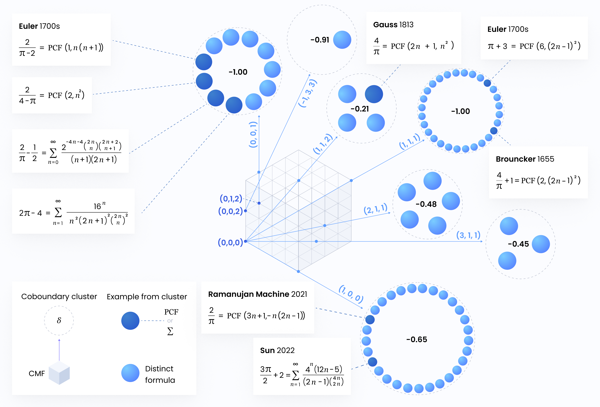
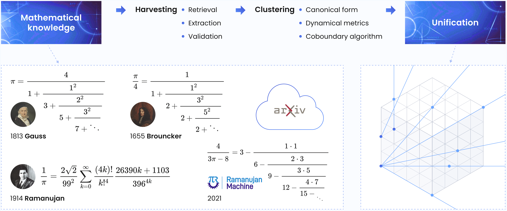

<p align="center"><em>A Conservative Matrix Field (CMF) contains many celebrated formulas from the literature.</em></p>

# From Euler to AI: Unifying Formulas for Mathematical Constants

This repository accompanies the research article "[From Euler to AI: Unifying Formulas for Mathematical Constants](https://arxiv.org/abs/2502.17533)."
The paper introduces a systematic methodology for discovering equivalences between formulas representing mathematical constants,
utilizing modern large language models for data collection and innovative mathematical algorithms for proof discovery.
Using this framework, many formulas are found to be embedded in a single mathematical structure termed a Conservative Matrix Field (CMF), which was [recently discovered](https://www.pnas.org/doi/10.1073/pnas.2321440121).
The project shows how AI can be paired with tailored algorithms to automatically unify and expand upon mathematical knowledge.

## Overview

There are two main stages to the process: **formula harvesting** (dataset acquisition) and **unification** (equivalence discovery and proof).

### Formula harvesting

A multi-stage pipeline extracts formulas calculating the constant of interest (e.g. $\pi$) from arXiv papers.

1. Scraping: equations are collected from arXiv papers.
2. Retrieval: equations are scanned for certain regular expressions.
3. Classification: an LLM decides whether each equation contains a formula that calculates the constant of interest, then classifies the type of formula (series, continued fraction or neither).
4. Extraction: an LLM converts LaTeX to SymPy code which can be used to reconstruct the formulas.
5. Validation: finding the symbolic value of the formula by numerically computing it.
6. Conversion to polynomial recurrences: via [RISC's tool](https://risc.jku.at/sw/guess/) (Mathematica, request access [here](https://www3.risc.jku.at/research/combinat/software/ergosum/installation.html#download)). A solution for formulas yielding second-order recurrences, the focus of this study, was implemented in Python for convenience.  
7. Conversion to canonical form: recurrences are normalized to have integer coefficient polynomials and simplified. Second-order recurrences are converted to polynomial continued fractions (PCFs).

### Unification

Now represented as polynomial recurrences, formulas undergo:  
1. Computation of dynamical metrics: the irrationality measure ($\delta$) and convergence rate ($r$) are calculated.
2. Initial clustering: based on the $\delta$ metric.
3. Unification: a new matching algorithm is applied to discover novel connections (compositions of "folds" + coboundary equivalences) between formulas. Some formulas inputted here are derived from a Conservative Matrix Field (CMF), and any formula proven equivalent to one of these is said to be "unified" by the CMF, completing the unification process.

The result is a graph—specifically a collection of cliques—containing novel transformations between formulas that establish their equivalence. Cliques containing CMF-derived formulas are unified by the CMF.  

## Getting Started

For a quick intro, please check out the tutorial [notebook](https://colab.research.google.com/drive/13EC9hwEhoA_xvEu_7p_9wbIl2QjDknqC?usp=sharing).

To reproduce the results and explore the methodologies presented in the paper, follow these steps:

### 1. Clone the repository and install the `unifier` package:  
   Clone the repository
   ```bash
   git clone https://github.com/RamanujanMachine/euler2ai.git
   ```
   create a new virtual environment, e.g.
   ```bash
   python -m venv euler2ai_env  
   euler2ai_env\Scripts\activate (Windows)
   ```
   and install the unifier package
   ```bash
   cd euler2ai
   pip install .
   ``` 
   Alternatively, install only the package to a new virtual environment  
   ```bash
   pip install git+https://github.com/RamanujanMachine/euler2ai.git
   ```
   and download the relevant data and scripts separately as needed.

**Proceed to [Unification](#3-unification) if you are interested in recreating the paper's results without testing the harvesting pipeline.**

### 2. Harvesting formulas:  
   The 7-step harvesting pipeline can be found under `harvesting`.  
   Under this directory, the file `config.py` contains the following settings:  
   - `BASE_DIR` (str): directory in which to store intermediate pipeline results, from each step.  
   - `ARXIV_IDS_OF_INTEREST` (list[str] or path to pickled list[str]): a list of arXiv ids to be scraped for formulas.  
   - `OPENAI_API_KEY` (str): your private OpenAI API key. (**Note**: **important!** Pipeline steps 3 and 4 below, respectively classification and extraction, will not work without a valid API key since they rely on GPT-4o and 4o mini)  
   - `CONSTANT` (str): (**Note**: only 'pi' is currently supported.) The constant of interest for which formulas should be harvested, as a LaTeX string. 
   - `MAX_WORKERS` (int): for multiprocessing (configure according to your machine), can only lower the number of workers used throughout the pipeline as the minimum between this and a default value is always taken.
   - `USE_GUESS` (bool): whether to use RISC's tool to find the recurrences corresponding to series (True), or use a Python implementation that does not require Mathematica (False, recommended).
   - `VALIDATION_TIMEOUT` (int): time in seconds to allow for computation and symbolic identification of a single formula's limit.
   - `MODEL` (str): OpenAI model to use for formula extraction.

   Customize `config.py` (`BASE_DIR` and `OPENAI_API_KEY` must be supplied), then run each of the following scripts in order:
   - `1_scraping.py`: (**Note**: may take a few weeks for hundreds of thousands of arXiv ids to ensure compliance with the arXiv API guidelines.) Collects LaTeX equation strings from each of the articles in the list `ARXIV_IDS_OF_INTEREST`.  
   - `2_retrieval.py`: Sifts for equations containing series or continued fractions that compute the constant of interest.
   - `3_classification.py`: Classifies each candidate formula as computing the constant of interest (passes to next step) or containing the constant's symbol (e.g. $\pi$) in an unrelated context (discarded). This step is intended to decrease the number of candidate LaTeX strings passed to the next stage.  
   - `4_extraction.py`: Collects information from LaTeX strings needed to reconstruct and compute the formula in a Computer Algebra System (CAS, SymPy in our case).
   - `5_validation.py`: Computes formulas and finds symbolic values (limits of series and continued fractions) in terms of the constant of interest.
   - `6_to_recurrence.py`: If `USE_GUESS` is True, computes the first 200 terms of each series in preparation for conversion to polynomial recurrences. Otherwise, uses our internal implementation to convert series to polynomial continued fractions (PCFs) where possible.
   - `6_to_recurrence.wl`: (**Note**: run only if `USE_GUESS` was set to True.) Mathematica code that uses RISC's tool to find the correct polynomial-coefficient linear recurrences for, e.g., sequences converging to irrational constants.
   - `7_merge_and_dynamical_metrics.py`: Collect and organize in a pandas DataFrame (and a json file for visual inspection) all validated formulas yielding polynomial recurrences of order 2, and convert all to canonical forms - polynomial continued fractions (PCFs). The irrationality measure ($\delta$) and convergence rate ($r$) are precomputed for each canonical form during this step for convenience. (**Note**: the focus of this study is formulas with order 2 polynomial linear recurrences as the vast majority of formulas collected were of this type: 402 vs 5. Higher-order recurrences can be addressed with the same algorithm, see Appendix B.3 of the paper.)  

   This results in a dataframe of formulas in canonical form (PCFs), their symbolic limits in terms of the constant of interest, and their dynamical metrics, along with source metadata, located in `BASE_DIR`.  

### 3. Unification:
Configure and run the script `grow_coboundary_graph.py`, which matches between formulas using initial clustering according to $\delta$, folding, and the UMAPS coboundary algorithm:  
   - `PCFS` (path to pickle): dataframe of harvested formulas in canonical form.  
   - `CMF_PCFS` (path to pickle): dataframe of formulas generated by the CMF. Best to use the file `cmf_pcfs_compact.pkl` which contains only the representative formulas needed to recreate the results from the paper.
   - `DELTA_GRANULARITY` (float): $\delta$ clustering resolution, controls the number of cluster "centers" attempted.
   - `DELTA_SIMILARITY_THRESHOLD` (float): max difference between $\delta$ and cluster "center" for inclusion in a cluster.
   - `START_DELTA`, `END_DELTA` (floats): clusters "centers" will be created between these $\delta$ values.  

The default settings recreate the file `results/coboundary_graph.pkl`, which stores the equivalence results for $\pi$ formulas found in the paper (it will appear as `coboundary_graphs/graph_<START_DELTA>_to_<END_DELTA>_matched_to_cmf_pcfs.pkl`).  

The resulting graph is a directed forest:  
   - each tree represents a clique of equivalent formulas.
   - each edge contains the discovered transformation from one formula to the other.

Trees that have formulas originating from the CMF (nodes with attribute `cmf_sources`) are unified by it, and thus proven to originate from a single mathematical object.  
Visualize the coboundary graph using the relevant section in `results/results.ipynb`.

## Citation
If you found the paper or code helpful, please consider citing them:
```bibtex
@misc{euler2ai,
      title={From Euler to AI: Unifying Formulas for Mathematical Constants}, 
      author={Tomer Raz and Michael Shalyt and Elyasheev Leibtag and Rotem Kalisch and Shachar Weinbaum and Yaron Hadad and Ido Kaminer},
      year={2025},
      eprint={2502.17533},
      archivePrefix={arXiv},
      primaryClass={math.HO},
      url={https://arxiv.org/abs/2502.17533}, 
}
```
